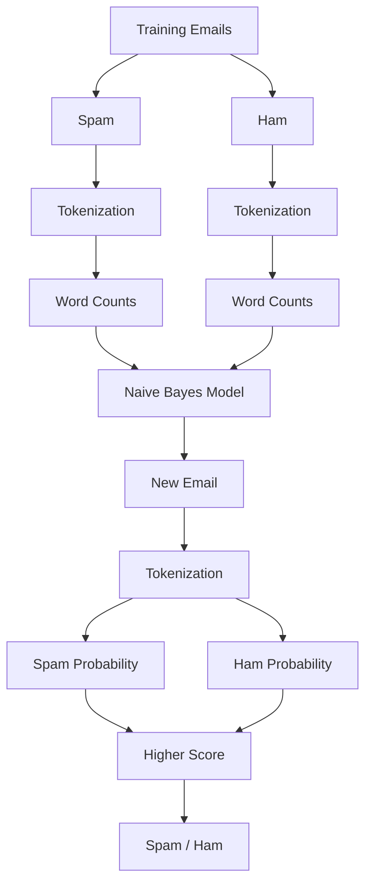

# Email Spam Classifier

A Naive Bayes spam classifier written in Go.

## How It Works

The classifier follows the **Naive Bayes** approach:

1. Parse emails from the training dataset.
2. Tokenize each email into words.
3. Count how frequently each word appears in Spam and Ham emails.
4. Calculate the probability of an email being Spam or Ham.
5. Classify the email based on the higher probability.

## Pipeline

## Tech Stack

* **Language:** Go
* **Dataset:** [Enron Email Dataset](https://www.kaggle.com/datasets/wcukierski/enron-email-dataset)
* **Algorithm:** Naive Bayes

